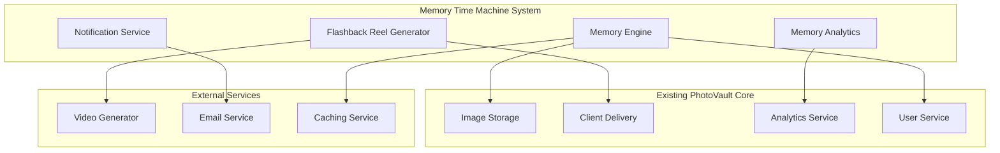
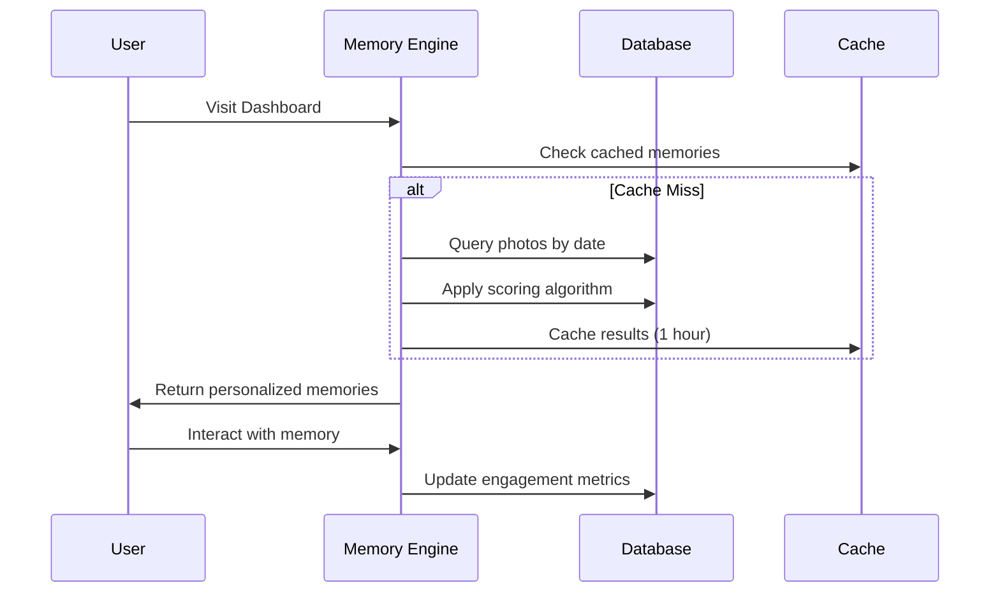

# Design Document: Memory Time Machine

## Overview

The Memory Time Machine transforms PhotoVault from a static photo storage system into an engaging daily experience that drives photographer retention and client acquisition. By automatically surfacing meaningful photos from the past and generating shareable flashback reels, this feature creates a compelling reason for photographers to visit PhotoVault daily while providing new content for client engagement.

The system leverages existing PhotoVault infrastructure (image storage, client delivery, analytics) while adding intelligent memory discovery, automated content generation, and engagement tracking capabilities.

## Architecture

### High-Level Architecture



### Memory Discovery Pipeline



## Components and Interfaces

### 1. Memory Engine (`apps/memories/services.py`)

**Core Service**: Discovers and ranks historical photos based on date, engagement, and significance.

```python
class MemoryEngine:
    def discover_daily_memories(self, user_id: int, target_date: date) -> List[Memory]
    def score_photo_significance(self, photo: Image, context: MemoryContext) -> float
    def expand_date_range(self, target_date: date, days: int = 7) -> List[date]
    def track_memory_engagement(self, memory_id: int, interaction_type: str) -> None
```

**Key Algorithms**:
- **Date Matching**: Exact date → ±3 days → ±7 days fallback
- **Significance Scoring**: Views + shares + client_delivery_count + recency_bonus
- **Diversity Filtering**: Ensure variety in locations, subjects, and time periods

### 2. Flashback Reel Generator (`apps/memories/reel_generator.py`)

**Automated Content Creation**: Generates video reels from photo collections using background processing.

```python
class FlashbackReelGenerator:
    def generate_reel(self, photos: List[Image], theme: str) -> ReelGenerationTask
    def select_representative_photos(self, photos: List[Image], count: int = 15) -> List[Image]
    def apply_transitions_and_music(self, photos: List[Image], duration: int = 30) -> VideoFile
    def create_shareable_link(self, reel: VideoFile, user: User) -> ShareLink
```

**Processing Pipeline**:
1. **Photo Selection**: Algorithm selects 10-20 best photos from time period
2. **Video Generation**: Celery task creates MP4 with transitions and music
3. **Integration**: Automatic integration with client delivery system
4. **Notification**: User notified when reel is ready

### 3. Memory Analytics (`apps/memories/analytics.py`)

**Insight Generation**: Analyzes photographic patterns and provides business intelligence.

```python
class MemoryAnalytics:
    def analyze_shooting_patterns(self, user_id: int, timeframe: str) -> ShootingPatterns
    def identify_seasonal_trends(self, user_id: int) -> SeasonalTrends
    def track_equipment_evolution(self, user_id: int) -> EquipmentTimeline
    def generate_portfolio_insights(self, user_id: int) -> PortfolioInsights
```

**Analytics Features**:
- **Seasonal Analysis**: Identify peak shooting seasons and location preferences
- **Equipment Tracking**: Show camera/lens usage evolution over time
- **Style Development**: Analyze color palettes, composition trends, subject matter
- **Business Metrics**: Most engaging time periods, client favorite eras

### 4. Notification Service (`apps/memories/notifications.py`)

**Engagement Driver**: Smart notification system that respects user preferences and engagement patterns.

```python
class MemoryNotificationService:
    def check_daily_memories(self, user_id: int) -> bool
    def send_memory_notification(self, user_id: int, memories: List[Memory]) -> None
    def adjust_frequency_based_on_engagement(self, user_id: int) -> None
    def create_notification_preview(self, memories: List[Memory]) -> NotificationPreview
```

## Data Models

### Memory Model

```python
class Memory(models.Model):
    user = models.ForeignKey(User, on_delete=models.CASCADE)
    target_date = models.DateField()  # The "on this day" date
    photos = models.ManyToManyField(Image, through='MemoryPhoto')
    significance_score = models.FloatField()
    created_at = models.DateTimeField(auto_now_add=True)
    last_viewed = models.DateTimeField(null=True)
    engagement_count = models.IntegerField(default=0)
    
    class Meta:
        unique_together = ['user', 'target_date']
        indexes = [
            models.Index(fields=['user', 'target_date']),
            models.Index(fields=['significance_score']),
        ]
```

### Flashback Reel Model

```python
class FlashbackReel(models.Model):
    user = models.ForeignKey(User, on_delete=models.CASCADE)
    title = models.CharField(max_length=200)
    photos = models.ManyToManyField(Image)
    video_file = models.FileField(upload_to='reels/')
    duration = models.IntegerField()  # seconds
    theme = models.CharField(max_length=50)
    status = models.CharField(max_length=20, choices=REEL_STATUS_CHOICES)
    share_link = models.OneToOneField(PublicShare, null=True, on_delete=models.SET_NULL)
    created_at = models.DateTimeField(auto_now_add=True)
    
    class Meta:
        indexes = [
            models.Index(fields=['user', 'created_at']),
            models.Index(fields=['status']),
        ]
```

### Memory Engagement Model

```python
class MemoryEngagement(models.Model):
    memory = models.ForeignKey(Memory, on_delete=models.CASCADE)
    interaction_type = models.CharField(max_length=20)  # view, share, like, download
    timestamp = models.DateTimeField(auto_now_add=True)
    ip_address = models.GenericIPAddressField(null=True)
    
    class Meta:
        indexes = [
            models.Index(fields=['memory', 'timestamp']),
            models.Index(fields=['interaction_type']),
        ]
```

## Correctness Properties

*A property is a characteristic or behavior that should hold true across all valid executions of a system-essentially, a formal statement about what the system should do. Properties serve as the bridge between human-readable specifications and machine-verifiable correctness guarantees.*

### Converting EARS to Properties

Based on the prework analysis, I'll convert the testable acceptance criteria into universally quantified properties:

**Property 1: Daily memory discovery consistency**
*For any* user and target date, when the Memory Engine is queried for daily memories, it should return photos taken on the same calendar date in previous years, or expand to within 7 days if no exact matches exist.
**Validates: Requirements 1.1, 1.3**

**Property 2: Significance-based ranking**
*For any* collection of photos from the same date with different engagement scores, the Memory Engine should return them ordered by significance score (highest first).
**Validates: Requirements 1.2**

**Property 3: Memory metadata completeness**
*For any* memory returned by the Memory Engine, it should include the original date and time context for each associated photo.
**Validates: Requirements 1.4**

**Property 4: Engagement tracking consistency**
*For any* memory interaction, the Memory Engine should record the engagement event and update future prioritization scores accordingly.
**Validates: Requirements 1.5**

**Property 5: Automatic reel generation threshold**
*For any* time period with sufficient photos (above the defined threshold), the Memory Engine should automatically generate a Flashback Reel.
**Validates: Requirements 2.1**

**Property 6: Reel photo selection bounds**
*For any* generated Flashback Reel, it should contain between 10 and 20 representative photos from the specified time period.
**Validates: Requirements 2.2**

**Property 7: Reel sharing integration**
*For any* completed Flashback Reel, it should be automatically integrated with the client delivery system and have a valid share link created.
**Validates: Requirements 2.4**

**Property 8: Privacy-respecting reel generation**
*For any* user with specific privacy settings, generated reels should only include photos that respect those privacy settings and album permissions.
**Validates: Requirements 2.5**

**Property 9: Notification triggering**
*For any* user with significant memories available, the Memory Engine should generate and send a Memory Notification according to their preferences.
**Validates: Requirements 3.1, 3.2**

**Property 10: Notification content completeness**
*For any* sent memory notification, it should include a preview of the available memories and a valid link to the full memory experience.
**Validates: Requirements 3.3, 3.4**

**Property 11: Adaptive notification frequency**
*For any* user who consistently ignores notifications, the Memory Engine should reduce notification frequency over time.
**Validates: Requirements 3.5**

**Property 12: Pattern recognition accuracy**
*For any* photo collection with identifiable seasonal or location patterns, the Memory Engine should correctly identify and report these patterns in the analytics.
**Validates: Requirements 4.1, 4.2**

**Property 13: Equipment tracking accuracy**
*For any* photo collection with equipment metadata, the Memory Engine should accurately track and display equipment usage evolution over time.
**Validates: Requirements 4.3**

**Property 14: Insights sharing functionality**
*For any* generated insights, the Memory Engine should create valid shareable links for portfolio marketing purposes.
**Validates: Requirements 4.5**

**Property 15: Client delivery integration**
*For any* shared memory or reel, it should be properly integrated with the client delivery system and track engagement metrics for the photographer.
**Validates: Requirements 5.1, 5.3, 5.5**

**Property 16: Professional presentation formatting**
*For any* shared memory, it should be formatted in a professional presentation style suitable for client viewing.
**Validates: Requirements 5.2**

**Property 17: Watermark application consistency**
*For any* publicly shared memory, appropriate watermarks and branding should be applied according to user settings.
**Validates: Requirements 5.4**

**Property 18: Privacy settings enforcement**
*For any* memory generation or sharing action, the Memory Engine should respect album privacy settings and user preferences.
**Validates: Requirements 6.1**

**Property 19: User control functionality**
*For any* user exclusion rule (hidden photos or time periods), the Memory Engine should respect these exclusions in all memory generation.
**Validates: Requirements 6.2**

**Property 20: Consent requirement enforcement**
*For any* memory sharing action, explicit user consent should be required and verified before sharing occurs.
**Validates: Requirements 6.4**

**Property 21: Complete opt-out functionality**
*For any* user who opts out of the Memory Time Machine feature, no memory-related processing should occur for that user.
**Validates: Requirements 6.5**

**Property 22: Performance bounds for memory generation**
*For any* photo collection, memory generation should complete within 5 seconds regardless of collection size.
**Validates: Requirements 7.1**

**Property 23: Concurrent access performance**
*For any* simultaneous memory access by multiple users, response times should remain under 200ms.
**Validates: Requirements 7.2**

**Property 24: Asynchronous reel processing**
*For any* flashback reel generation, the process should run asynchronously without blocking other user interactions.
**Validates: Requirements 7.3**

## Error Handling

### Memory Discovery Errors
- **No Photos Found**: Gracefully handle users with insufficient photo history
- **Date Range Expansion**: Automatically expand search criteria when exact matches fail
- **Corrupted Photo Metadata**: Skip photos with invalid date/time information
- **Database Timeouts**: Implement query timeouts and fallback to cached results

### Reel Generation Errors
- **Video Processing Failures**: Retry with different parameters, fallback to photo slideshow
- **Insufficient Photos**: Require minimum photo count before attempting reel generation
- **Storage Limits**: Implement cleanup of old reels to manage storage usage
- **External Service Failures**: Queue reel generation for retry when video services are unavailable

### Notification Errors
- **Email Delivery Failures**: Implement retry logic with exponential backoff
- **User Preference Conflicts**: Resolve conflicts by defaulting to most restrictive settings
- **Rate Limiting**: Respect notification frequency limits even when significant memories are available

### Privacy and Security Errors
- **Unauthorized Access**: Ensure memory access is properly authenticated and authorized
- **Privacy Violations**: Double-check privacy settings before any sharing or notification
- **Data Leakage**: Prevent exposure of private photos in public memory shares

## Testing Strategy

### Dual Testing Approach
The Memory Time Machine will use both unit testing and property-based testing for comprehensive coverage:

**Unit Tests**: Focus on specific examples, edge cases, and error conditions
- Test specific date scenarios (leap years, edge dates, timezone handling)
- Test integration points with existing PhotoVault systems
- Test error conditions and fallback behaviors
- Test notification delivery and user preference handling

**Property Tests**: Verify universal properties across all inputs
- Test memory discovery algorithms with randomized photo collections
- Test reel generation with various photo set sizes and characteristics
- Test privacy enforcement across different user permission combinations
- Test performance requirements under various load conditions

### Property-Based Testing Configuration
- **Testing Framework**: Use Hypothesis for Python property-based testing
- **Test Iterations**: Minimum 100 iterations per property test
- **Test Tagging**: Each property test tagged with format: **Feature: memory-time-machine, Property {number}: {property_text}**
- **Coverage Requirements**: 85%+ code coverage combining unit and property tests

### Integration Testing
- **Client Delivery Integration**: Test seamless integration with existing share system
- **Analytics Integration**: Verify memory engagement data flows to analytics dashboard
- **Notification Integration**: Test email delivery and user preference systems
- **Performance Testing**: Load testing with realistic photo collection sizes

### User Acceptance Testing
- **Photographer Workflow**: Test complete memory discovery and sharing workflow
- **Client Experience**: Test client viewing experience for shared memories and reels
- **Mobile Responsiveness**: Ensure memory features work across all device types
- **Accessibility**: Verify memory features meet accessibility standards